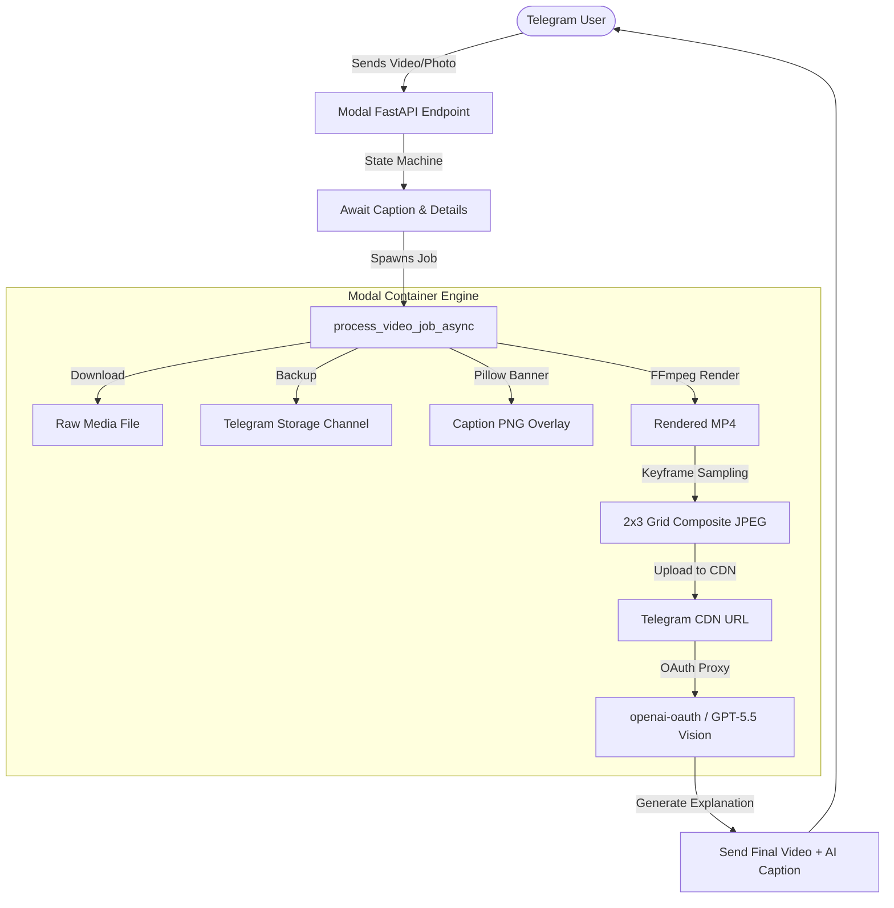

# Modal Video Editor 🎬🤖

[](https://modal.com)
[](https://core.telegram.org/bots/api)
[](https://ffmpeg.org)
[](https://python.org)

An automated, serverless Telegram Video Editor & Vision AI explanation engine powered by **Modal**, **FFmpeg**, **FastAPI**, and **GPT-5.5 / GPT-4o Vision** via embedded `openai-oauth`.

---

## ✨ Features

- **📱 Interactive Telegram State Machine**:
  - Simple conversational workflow for Telegram users.
  - Supports both **video** and **photo** inputs.
  - Custom multi-line caption text rendering.
  - Interactive inline keyboard buttons for toggling video fade-in effects.
  - Optional user-provided context & extra video details.

- **⚡ Serverless Cloud Video Rendering (Modal + FFmpeg)**:
  - Renders 9:16 vertical compositions (`1080x1920` @ 30 FPS) ready for **Instagram Reels**, **TikTok**, and **YouTube Shorts**.
  - Dynamic text wrapping and text banner creation using **Pillow** (`Montserrat-ExtraBold` typography).
  - Smooth fade-in layer blending and audio stream preservation.
  - Ultra-fast serverless container scaling via Modal.

- **👁️ Multi-Frame 2x3 Grid Vision AI Engine**:
  - Extracts 6 evenly spaced keyframes from videos across the timeline.
  - Stitches keyframes into a composite **2x3 grid image** to analyze full spatial-temporal context in a single Vision API call.
  - Leverages Telegram CDN for direct public HTTPS URL hosting during AI inference.
  - Runs an embedded `openai-oauth` proxy inside Modal containers for zero-cost AI Vision model access (`gpt-5.5`).
  - Automatically crafts witty, modern, Gen-Z / Reddit-style captions, scientific breakdowns, and trending hashtags.

- **🧹 Automatic Backups & Clutter-Free Chat Cleanup**:
  - Asynchronously backs up raw user inputs and text captions to a secondary Telegram storage bot.
  - Auto-deletes intermediate prompt messages to leave only the final rendered video and AI caption in the Telegram chat.

---

## 🛠️ Architecture Overview



---

## 🚀 Getting Started

### Prerequisites

- [Python 3.10+](https://www.python.org/)
- [Modal Account](https://modal.com) (`pip install modal` and run `modal setup`)
- Telegram Bot Token from [@BotFather](https://t.me/BotFather)
- Optional: Storage Bot Token for automated cloud backup
- `~/.codex/auth.json` (OpenAI OAuth auth file for local proxy integration)

---

## 🔐 Environment & Modal Secrets Setup

Create a Modal secret named `telegram-video-bot-secrets`:

```bash
modal secret create telegram-video-bot-secrets \
  BOT_TOKEN="your_telegram_bot_token_here" \
  STORAGE_BOT_TOKEN="your_storage_bot_token_here"
```

---

## 🏃 Running & Deploying

### 1. Local / Remote Testing
Test the Vision AI pipeline and container rendering directly from your terminal:

```bash
modal run modal_video_editor.py
```

### 2. Deploy Webhook Endpoint
Deploy the application to Modal serverless infrastructure:

```bash
modal deploy modal_video_editor.py
```

After deployment, Modal will output your FastAPI Webhook URL:
```text
Created web endpoint: https://<your-username>--televideditor-modal-telegram-webhook.modal.run
```

### 3. Register Telegram Webhook
Connect your Telegram Bot to the Modal endpoint:

```bash
curl -X POST "https://api.telegram.org/bot<YOUR_BOT_TOKEN>/setWebhook" \
  -H "Content-Type: application/json" \
  -d '{"url": "https://<your-username>--televideditor-modal-telegram-webhook.modal.run"}'
```

---

## 📂 Project Structure

```text
modal-video-editor/
├── modal_video_editor.py   # Main Modal app, FastAPI webhook & video processing pipeline
├── Montserrat-ExtraBold.ttf # Custom font for video text overlays
├── requirements.txt        # Python dependencies
├── .gitignore              # Files ignored by Git
└── README.md               # Project documentation
```

---

## 📄 License

MIT License. Feel free to use, modify, and distribute!
